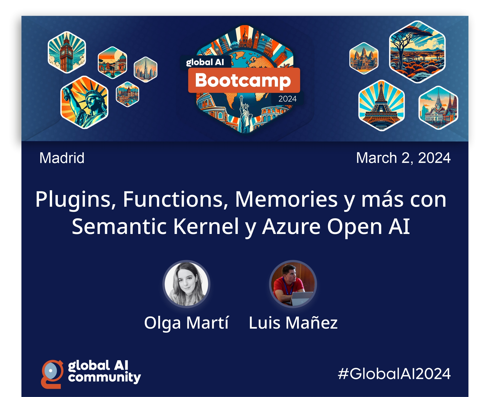

# Global AI Madrid 2024: Plugins, Functions, Memories y más con Semantic Kernel y Azure Open AI

Materiales de la sesión "Plugins, Functions, Memories y más con Semantic Kernel y Azure Open AI" para el Global AI Bootcamp Madrid 2 Marzo 2024 (co-impartida con Olga Marti)

En esta sesión aprenderás como integrar modelos LLM en tu aplicación .NET, utilizando open-source Semantic Kernel SDK. Sin ser un experto en "Generative AI", Semantic Kernel te permite crear Plugins, crear funciones semánticas para trabajar más rápido a través de plantillas de prompts, y dotar de contexto y tus datos a LLM a través de la creación de memorias. No te pierdas esta sesión para descubrir nuestros consejos a la hora de construir tu aplicación con "Generative AI" con Semantic Kernel.